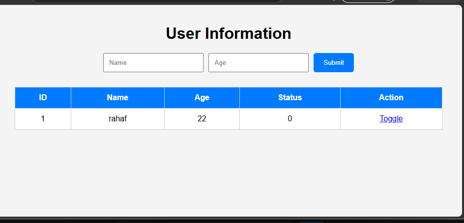

# User-Management-System

## Overview

This project is a simple web application developed using HTML, CSS, PHP, and MySQL. It allows users to enter their name and age through a single-line form, stores the submitted data in a MySQL database, displays all records in a table, and provides a toggle button to switch the status value between 0 and 1.

## Features

- Single-line form for entering name and age
- Store submitted data in a MySQL database
- Display all records in a table
- Toggle status between 0 and 1
- Automatic page refresh after updating status

## Technologies Used

- HTML
- CSS
- JS
- PHP
- MySQL
- XAMPP

Task_Web/
│── index.php
│── db.php
│── toggle.php
│── style.css
│── script.js
│── database.sql
│── README.md
└── screenshot.png

## Database

Database Name:

```
taskdb
```

Database Script:

```
database.sql
```

Table Name:

```
users
```

Table Columns

| Column | Type |
|---------|------|
| id | INT |
| name | VARCHAR(100) |
| age | INT |
| status | TINYINT(1) |


## How to Run

1. Install XAMPP.
2. Start Apache and MySQL.
3. Copy the project folder to:
   ```
   C:\xampp\htdocs\
   ```
4. Open phpMyAdmin.
5. Import the `database.sql` file.
6. Open:
   ```
   http://localhost/Task_Web/index.php
   ```

## Screenshot


